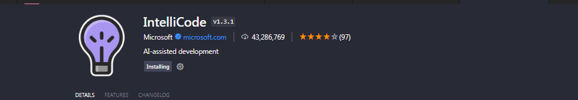

# SE-Assignment-5
Installation and Navigation of Visual Studio Code (VS Code)
 Instructions:
Answer the following questions based on your understanding of the installation and navigation of Visual Studio Code (VS Code). Provide detailed explanations and examples where appropriate.

 Questions:

1. Installation of VS Code:
   - Describe the steps to download and install Visual Studio Code on Windows 11 operating system. Include any prerequisites that might be needed.
   
   ANSWER

   Installing Visual Studio Code on Windows eleven

Prerequisites
- Windows 11 Operating System
- Administrator Rights

Step-via-Step Instructions

Step 1: Download Visual Studio Code

1. Visit the Official Website:
   - I opened my web browser and went to the [Visual Studio Code download page](https://code.Visualstudio.Com/).

2. Download the Installer:
   - I clicked at the "Download for Windows" button to down load the installer record (`VSCodeUserSetup-x64-<version>.Exe`).

Step 2: Run the Installer

1. Locate the Downloaded File:
   - I navigated to my Downloads folder and determined the `VSCodeUserSetup-x64-<version>.Exe` document.

2. Run the Installer:
   - I double-clicked the installer file to start the set up technique.

Step three: Install Visual Studio Code

1. Begin Installation:
   - I clicked "Next" on the welcome screen.

2. Accept License Agreement:
   - I checked the "I accept the settlement" field and clicked "Next".

3. Select Destination Location:
   - I chose the set up vicinity or stored the default path and clicked "Next".

4. Select Start Menu Folder:
   - I selected the Start Menu folder for shortcuts or used the default and clicked "Next".

Five. Select Additional Tasks:
   - I chose additional responsibilities, together with growing a computer icon and including VS Code to the PATH, then clicked "Next".

6. Ready to Install:
   - I reviewed my settings and clicked "Install" to begin the installation.

7. Complete Installation:
   - Once the installation became entire, I chose to launch Visual Studio Code right away and clicked "Finish" to go out the installer.

Step four: Launch Visual Studio Code

1. Open VS Code:
   - I opened Visual Studio Code from the Start Menu or the computing device icon.

2. Initial Setup:
   - On the primary launch, I followed the on-display screen instructions to put in any extra components or extensions I needed.

Now, Visual Studio Code is established and prepared to be used on my Windows eleven system.

2. First-time Setup:
   - After installing VS Code, what initial configurations and settings should be adjusted for an optimal coding environment? Mention any important settings or extensions.

ANSWER

My Initial Configurations for Visual Studio Code on Windows 11

After putting in Visual Studio Code, I made the following modifications for an top of the line coding environment:

Essential Settings
- Format on Save: Enabled vehicle-formatting on shop.
- Tab Size and Spaces: Set tab size to 4 and transformed tabs to spaces.
- Word Wrap: Enabled phrase wrap.
- Theme and Font: Customized the appearance with a desired subject matter and font.
- Terminal Shell: Set the incorporated terminal to apply Git Bash.
Essential Extensions
- Python: Installed for higher Python support.
- Prettier - Code Formatter: Installed for computerized code formatting.
- GitLens: Installed to enhance Git skills.
- ESLint: Installed for JavaScript and TypeScript linting.
- Bracket Pair Colorizer: Installed to distinguish matching brackets.
- Live Server: Installed to release a improvement server with stay reload.
- Visual Studio IntelliCode: Installed for AI-assisted code completions. 

Additional Configurations
-Workspace Settings: Created challenge-unique settings.
- Keybindings: Customized shortcuts for performance.
- Snippet Configuration: Created custom code snippets.
- Sync Settings: Enabled settings sync for consistency throughout gadgets.

These configurations and extensions helped me create a streamlined and green coding surroundings in Visual Studio Code on Windows 11.

3. User Interface Overview:
   - Explain the main components of the VS Code user interface. Identify and describe the purpose of the Activity Bar, Side Bar, Editor Group, and Status Bar.

ANSWER

Main Components of the Visual Studio Code (VS Code) User Interface
Visual Studio Code (VS Code) has a user-friendly interface that is divided into several main components. Understanding these components helps in navigating and utilizing the editor effectively.

1. Activity Bar
Location: On the far left side of the window.
Purpose: Provides quick access to different views and major functions within VS Code.
Components:
Explorer: Access and manage files and folders.
Search: Perform project-wide search and replace.
Source Control: Manage version control with Git and other SCM providers.
Run and Debug: Manage debugging configurations and control the debugging process.
Extensions: Install and manage extensions to enhance functionality.

2. Side Bar
Location: To the right of the Activity Bar.
Purpose: Displays the content for the selected activity from the Activity Bar, providing detailed views and interactions.
Components:
File Explorer: View and manage files and folders.
Search Results: View search results.
Source Control Management: Interact with source control features.
Debugging Information: View and control debugging sessions.
Extensions: Browse and install extensions.

3. Editor Group
Location: Central part of the window.
Purpose: Main area where files are opened and edited.
Components:
Tabs: Each open file or resource is represented by a tab.
Multiple Editors: Supports splitting the editor into multiple groups to view and edit multiple files side-by-side.
Code Editing: Includes features like syntax highlighting, code completion, linting, and more.

4. Status Bar
Location: Bottom of the window.
Purpose: Provides information about the current state of the editor and context-specific details.
Components:
File Information: Shows details about the current file, such as encoding, line endings, and language mode.
Git Branch: Displays the current Git branch.
Errors and Warnings: Shows the count of errors and warnings in the workspace.
Live Server: Indicates if the live server is running.
Language Mode: Allows changing the language mode of the current file.
Notification Icons: Shows status of background operations and extension notifications.

Summary
Activity Bar: Provides quick access to core features and views.
Side Bar: Displays detailed views based on the selected activity.
Editor Group: Main area for viewing and editing files, supporting multiple editors.
Status Bar: Shows information about the current state of the editor and file, including errors, warnings, and Git status.
Understanding these components helps in efficiently navigating and using VS Code to its full potential.

4. Command Palette:
   - What is the Command Palette in VS Code, and how can it be accessed? Provide examples of common tasks that can be performed using the Command Palette.

ANSWER

VS Code Command Palette (Ctrl+Shift+P) acts as your central hub for all editor functionalities. Type keywords to find and execute actions like opening files, formatting code, or using the terminal. It boosts your workflow by offering quick access and promoting keyboard shortcuts.

5. Extensions in VS Code:
   - Discuss the role of extensions in VS Code. How can users find, install, and manage extensions? Provide examples of essential extensions for web development.

   ANSWER

   Summary of Using Extensions in VS Code for Web Development

The Role of Extensions
Extensions in VS Code enhance functionality by adding support for new languages, tools, and customizations, making my development environment more powerful and tailored to my needs.

Finding, Installing, and Managing Extensions
- Finding Extensions: I open the Extensions view with the Extensions icon in the Activity Bar or by pressing `Ctrl+Shift+X`, then search or browse categories like "Popular" and "Recommended."
- Installing Extensions: I click "Install" next to the extension I want, and it installs automatically. I may need to reload VS Code to activate it.
- Managing Extensions: I view my installed extensions in the Extensions view, update them as needed, and uninstall by clicking the gear icon and selecting "Uninstall."

Essential Extensions for Web Development
1. Prettier - Code Formatter: Formats my code automatically.
2. ESLint: Provides linting for JavaScript and TypeScript.
3. Live Server: Launches a local server with live reload.
4. Path Intellisense: Autocompletes filenames.
5. Bracket Pair Colorizer: Colors matching brackets for readability.
6. Debugger for Chrome: Allows debugging in Google Chrome.
7. GitLens: Enhances Git capabilities with features like blame annotations and repository history.

Using these extensions, I improve my web development workflow, making it more efficient and productive.

6. Integrated Terminal:
   - Describe how to open and use the integrated terminal in VS Code. What are the advantages of using the integrated terminal compared to an external terminal?

answer

Using the Integrated Terminal in VS Code

Opening the Terminal
- Menu: `View > Terminal`
- Shortcut: `Ctrl + ` `
- Activity Bar: Click the terminal icon

Using the Terminal
- Multiple Terminals: Click the plus icon (+) or use `Ctrl + Shift + P` and type "Create New Integrated Terminal."
- Switch Tabs: Click on terminal tabs at the top of the terminal panel.
- Split Terminal: Click the split icon or use the command palette.
- Choose Shell: Use the dropdown menu in the terminal panel.

Advantages
- Convenience: Integrated with the editor, opens in project root.
- Productivity: Side-by-side coding, multiple terminals.
- Customization: Persistent sessions, consistent theme and fonts.
- Features: Quick commands, terminal splitting.

Using the integrated terminal makes my workflow more efficient and convenient by keeping everything within VS Code.

7. File and Folder Management:
   - Explain how to create, open, and manage files and folders in VS Code. How can users navigate between different files and directories efficiently?

ANSWER

Using the Integrated Terminal in VS Code

Opening the Terminal
- Menu: `View > Terminal`
- Shortcut: `Ctrl   ` `
- Activity Bar: Click the terminal icon

Using the Terminal
- Multiple Terminals: Click the plus icon ( ) or `Ctrl   Shift   P` > "Create New Integrated Terminal"
- Switch Tabs: Click terminal tabs
- Split Terminal: Click the split icon or use the command palette
- Choose Shell: Use the dropdown menu in the terminal panel

Advantages
- Convenience: Integrated, opens in task root
- Productivity: Side-via-facet coding, more than one terminals
- Customization: Persistent sessions, steady subject/fonts
- Features: Quick instructions, terminal splitting

Using the included terminal is efficient and convenient, keeping the whole lot inside VS Code.

8. Settings and Preferences:
   - Where can users find and customize settings in VS Code? Provide examples of how to change the theme, font size, and keybindings.

ANSWER

### Customizing Settings in VS Code

#### Accessing Settings
- **Menu**: `File > Preferences > Settings` or `Ctrl + ,`
- **Command Palette**: `Ctrl + Shift + P` > "Preferences: Open Settings"

#### Changing the Theme
1. Open settings with `Ctrl + ,`.
2. Search for "Theme."
3. Select "Color Theme."
4. Choose "Dark+ (default dark)."

#### Changing the Font Size
1. Open settings with `Ctrl + ,`.
2. Search for "Font Size."
3. Set the value to 14.

#### Customizing Keybindings
1. Open Keyboard Shortcuts with `Ctrl + K, Ctrl + S`.
2. Search for "Format Document."
3. Change to `Ctrl + Alt + F`.

By doing this, I customize VS Code to fit my preferences and improve my workflow.

9. Debugging in VS Code:
   - Outline the steps to set up and start debugging a simple program in VS Code. What are some key debugging features available in VS Code?

   ANSWER

   Sure, here's a concise summary in the first person:

To debug in VS Code:
1. I open or create my project and write the code.
2. If needed, I install the Python extension or any relevant extensions for debugging.
3. I configure the debugger by setting up a `launch.json` file and specifying the program to debug.
4. Setting breakpoints allows me to pause execution at specific lines for inspection.
5. Starting debugging is as simple as pressing `F5`. I can then inspect variables and step through the code using `F10` (step over), `F11` (step into), and `Shift + F11` (step out).

VS Code's debugging features, such as breakpoints, variable inspection, call stack viewing, watch expressions, and an integrated terminal, make the debugging process straightforward and efficient.

10. Using Source Control:
    - How can users integrate Git with VS Code for version control? Describe the process of initializing a repository, making commits, and pushing changes to GitHub.

ANSWER

Integrating Git with VS Code involves:

1. **Initializing a Repository**:
   - Open the project in VS Code.
   - Open the integrated terminal (`Ctrl + ` `) and run `git init`.

2. **Making Commits**:
   - Stage changes using the Source Control view (`Ctrl + Shift + G`).
   - Commit changes with a message (`Ctrl + Enter`).

3. **Pushing Changes to GitHub**:
   - Create a repository on GitHub.
   - Add the GitHub repository as a remote (`git remote add origin <repository-url>`).
   - Push changes to GitHub (`git push -u origin main`).

This process enables efficient version control directly from within VS Code.

 Submission Guidelines:
- Your answers should be well-structured, concise, and to the point.
- Provide screenshots or step-by-step instructions where applicable.
- Cite any references or sources you use in your answers.
- Submit your completed assignment by 1st July 

